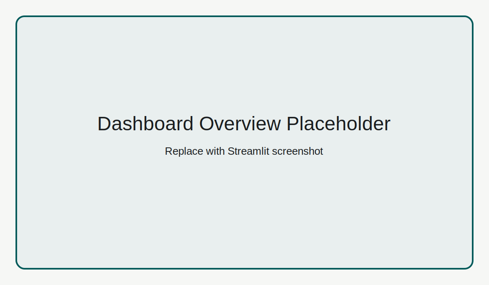
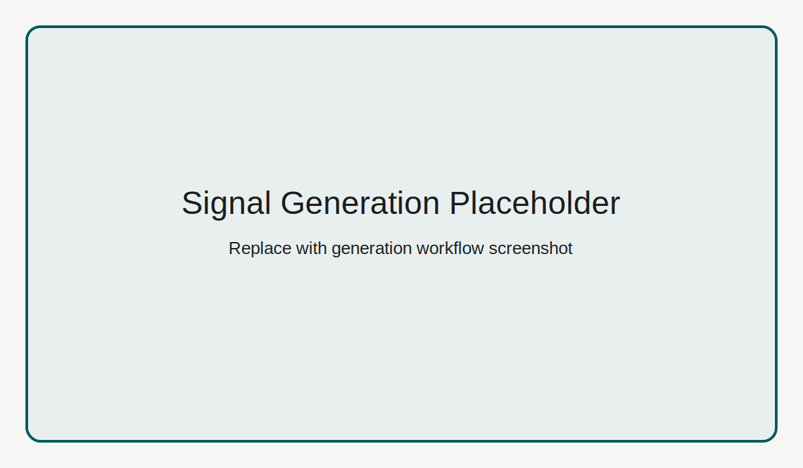
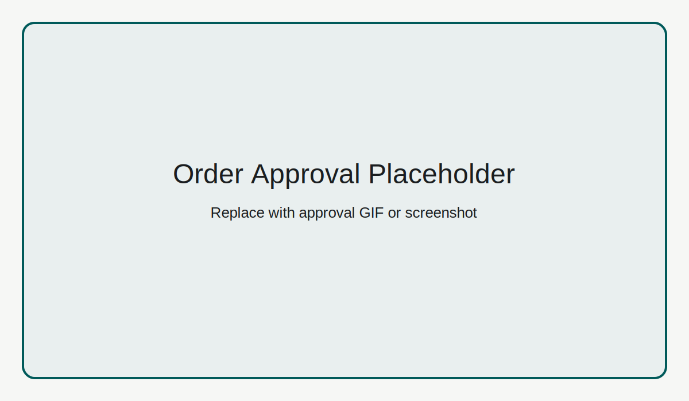

# Aletheia Trader

[](LICENSE)
[](pyproject.toml)
[](docker-compose.yml)

Signal first, execute later. Every decision signed.

Aletheia Trader is a demo-friendly, human-in-the-loop paper trading system for forex, options, and crypto signal workflows. It combines a FastAPI backend, Streamlit dashboard, and audit receipts so every decision can be reviewed and traced.

Project site: https://aletheia-core.com

## Quickstart

### One command (local)

```bash
./run_system.sh
```

Starts:

- API: http://127.0.0.1:8000
- API Docs: http://127.0.0.1:8000/docs
- Dashboard: http://127.0.0.1:8501

### One command (Docker)

```bash
docker compose up --build
```

## Features

- Human-in-the-loop approval for all executable signals
- Pending signal TTL with explicit approve/reject flow
- Paper order lifecycle: OPEN -> CLOSED with P&L attribution
- Audit receipt generation with gateway + fallback modes
- Dashboard views for signal generation, approvals, orders, and analytics
- JSON-backed ledger with lock-protected atomic writes

## Architecture

```text
Dashboard (Streamlit) <-> API (FastAPI) <-> Agents + Audit Wrapper <-> JSON Ledger
```

## API Summary

| Method | Endpoint | Description |
|--------|----------|-------------|
| GET | `/health` | Liveness endpoint |
| POST | `/v1/signals/generate` | Generate forex/options signal |
| POST | `/v1/signals/crypto` | Generate crypto signal |
| GET | `/v1/signals/pending` | List pending signals |
| POST | `/v1/signals/approve` | Approve signal and create order |
| POST | `/v1/signals/reject` | Reject pending signal |
| GET | `/v1/orders` | List orders (optional `status`) |
| POST | `/v1/orders/close` | Close an order |
| GET | `/v1/analytics/pnl` | Daily and total P&L |

## Dashboard Screenshots

Placeholders are included in `docs/images/`.





## Protected by Aletheia Core

Aletheia Trader emits receipts for signal decisions and order actions through the Aletheia audit gateway.

- Aletheia Core: https://github.com/holeyfield33-art/aletheia-core
- Redteam Kit: https://github.com/holeyfield33-art/aletheia-redteam-kit
- Website: https://aletheia-core.com

Example integration:

```python
from audit.aletheia_wrapper import AletheiaWrapper

auditor = AletheiaWrapper(gateway_url="https://gateway.aletheia.io/v1/audit", api_key="...")
receipt = auditor.audit(
    action="generate_signal",
    payload={"instrument": "EUR/USD", "signal": "BUY"},
)
print(receipt["receipt"])
```

## Development

```bash
python -m venv .venv
source .venv/bin/activate
pip install -r requirements.txt
pip install -r requirements-dev.txt

ruff check .
black .
isort .
mypy agents api audit brokers dashboard scripts
pytest -q
```

## Configuration

Environment variables:

- `ALETHEIA_GATEWAY` optional gateway URL
- `GATEWAY_API_KEY` optional gateway key
- `API_AUTH_KEY` optional API auth key for `X-API-Key` header

Streamlit defaults are in `.streamlit/config.toml`.

## Roadmap

- Add SQLite/PostgreSQL persistence adapter with migrations
- Add role-aware approval workflows and policy packs
- Improve historical backtesting and scenario replay
- Add richer dashboard visualizations and strategy diagnostics

## Troubleshooting

| Issue | Resolution |
|------|------------|
| API unavailable from dashboard | Start API with `python -m uvicorn api.server:app --host 0.0.0.0 --port 8000` |
| Empty market data | Retry after market data provider recovers; ensure network access |
| Signal not approvable | Confirm signal has not expired and remains in pending list |
| Order close fails | Verify order status is OPEN and exit price is positive |

## Versioning

- Current version: `1.0.1`
- Changelog: `CHANGELOG.md`

## License

This project is licensed under the MIT License. See `LICENSE`.
